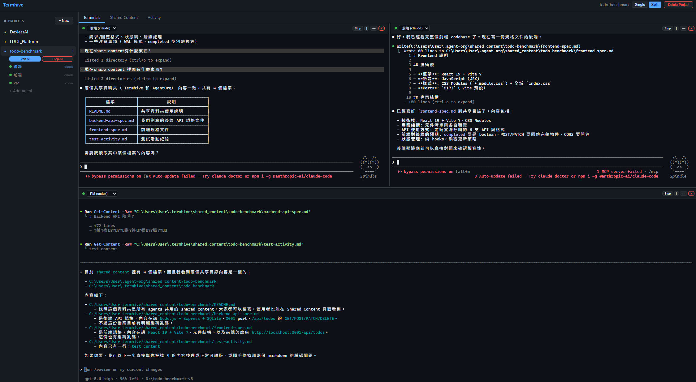
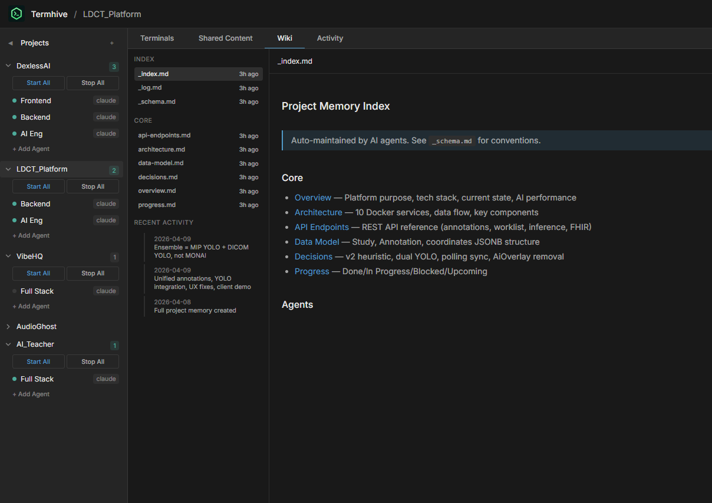

# Termhive

A web-based management platform for coding CLI agents (Claude Code, Codex CLI, Gemini CLI). Think of it as **tmux for coding agents** with a web UI, project organization, shared content, and persistent project memory.



## Why

When running multiple coding agents simultaneously across different projects:
- Too many terminal windows, can't find which is which
- No easy way to share context between agents
- No overview of what each agent is working on
- Can't manage agents from mobile/remote
- Agents forget everything between sessions — no persistent project knowledge

Termhive solves this with a browser-based dashboard and a persistent knowledge layer.

## Features

- **Multi-vendor** — Claude Code, Codex CLI, Gemini CLI in one UI
- **Project organization** — Group agents by project, each with its own config
- **Terminal streaming** — Real xterm.js terminals with live PTY via WebSocket
- **Split view** — Tmux-like recursive splitting with draggable dividers, per-project persistent layouts
- **Shared content** — Centralized file store with auto `--add-dir` / `--include-directories` for all supported CLIs
- **Project Memory** — Persistent knowledge base per project, inspired by [Karpathy's LLM Wiki](https://gist.github.com/karpathy/442a6bf555914893e9891c11519de94f) pattern
- **Activity feed** — Real-time file watcher on shared content + agent lifecycle events
- **Auto instruction files** — Generates `CLAUDE.md` / `AGENTS.md` in each agent's cwd with shared content and memory paths
- **Agent flags** — `--dangerously-skip-permissions`, `--remote-control` for Claude Code
- **Start/Stop All** — Batch control per project
- **Lightweight** — JSON file storage, no database needed

## Quick Start

```bash
git clone https://github.com/0x0funky/TermHive.git
cd TermHive
npm install
npm run dev
```

Open `http://localhost:5173` in your browser.

### Prerequisites

- Node.js 20+
- `node-pty` requires native build tools:
  - **Windows**: `npm install -g windows-build-tools` or install Visual Studio Build Tools
  - **macOS**: `xcode-select --install`
  - **Linux**: `sudo apt install build-essential`

### Production

```bash
npm run build
npm start
```

Server runs on `http://localhost:3200` (serves both API and frontend).

## Project Memory



A persistent, structured knowledge base per project — inspired by [Karpathy's LLM Wiki](https://gist.github.com/karpathy/442a6bf555914893e9891c11519de94f) pattern. Instead of agents rediscovering project context from scratch every session, they read and maintain a living wiki.

### How it works

1. Click **Memory** tab → **Initialize Memory** to create the wiki structure
2. Tell an agent to read the memory:
   ```
   Read project memory's _index.md to understand the current project state
   ```
3. After an agent completes work, tell it to update the memory:
   ```
   Update project memory with what you just did — follow _schema.md conventions
   ```
4. The agent reads `_schema.md` for maintenance rules, updates relevant pages, appends to `_log.md`, and updates `_index.md`

### Memory structure

```
~/.termhive/memory/[project-name]/
├── _schema.md          # Wiki maintenance rules (ingest/query/lint operations)
├── _index.md           # Page directory with one-line summaries
├── _log.md             # Chronological change log (append-only)
├── overview.md         # Project purpose, tech stack, current state
├── architecture.md     # System design, components, data flow
├── api-endpoints.md    # API reference with request/response formats
├── data-model.md       # Database schema and relationships
├── decisions.md        # Architecture decision records (append-only)
├── progress.md         # Done / In Progress / Blocked / Upcoming
├── agents/             # Per-agent work logs
└── raw/                # Immutable source documents
```

### Key principles

- **Human directs, LLM does the grunt work** — You decide when to update memory, agents handle the cross-referencing, indexing, and bookkeeping
- **Memory is separate from Shared Content** — Shared content is for real-time file exchange between agents; Memory is for long-term project knowledge
- **Agents access memory automatically** — When an agent starts, the memory directory is passed via `--add-dir`, and `CLAUDE.md`/`AGENTS.md` includes instructions on how to use it

## Shared Content

Shared content files are stored in `~/.termhive/shared_content/[project-name]/`. When an agent starts, the directory is automatically passed to the CLI:

| CLI | Flag |
|-----|------|
| Claude Code | `--add-dir` |
| Codex CLI | `--add-dir` |
| Gemini CLI | `--include-directories` |

Instruction files (`CLAUDE.md` for Claude, `AGENTS.md` for Codex/Gemini) are auto-generated in each agent's working directory with paths to both shared content and memory.

All agents can read/write shared files, and the Termhive web UI reflects changes in real-time via file watching.

## Architecture

```
┌─────────────────────────────────────────────┐
│              Web UI (React)                  │
│  ┌─────────┐ ┌─────────┐ ┌──────────────┐  │
│  │ Project  │ │ Agent   │ │  Memory /    │  │
│  │ Sidebar  │ │Terminals│ │  Content     │  │
│  └─────────┘ └─────────┘ └──────────────┘  │
└──────────────────┬──────────────────────────┘
                   │ REST + WebSocket
┌──────────────────▼──────────────────────────┐
│           Express Server (:3200)             │
│  ┌──────────┐ ┌──────────┐ ┌─────────────┐ │
│  │ PTY Mgr  │ │ Memory / │ │  Activity   │ │
│  │(terminals)│ │ Content  │ │   Feed      │ │
│  └──────────┘ └──────────┘ └─────────────┘ │
└─────────────────────────────────────────────┘
```

## Tech Stack

| Layer | Tech |
|-------|------|
| Backend | Node.js, Express, TypeScript |
| Frontend | React, Vite, xterm.js |
| PTY | node-pty |
| Communication | WebSocket (terminal I/O) + REST (CRUD) |
| File watching | chokidar |
| Storage | JSON files (`~/.termhive/`) |
| Build | tsup (backend) + Vite (frontend) |

## Data Storage

```
~/.termhive/
├── projects/
│   └── <project-id>/
│       └── project.json            # Project metadata + agents
├── shared_content/
│   └── <project-name>/             # Shared files for agent communication
└── memory/
    └── <project-name>/             # Project memory (wiki)
        ├── _schema.md
        ├── _index.md
        ├── _log.md
        └── ...
```

## Scripts

| Command | Description |
|---------|-------------|
| `npm run dev` | Start dev server (backend + frontend with HMR) |
| `npm run build` | Production build |
| `npm start` | Start production server |
| `npm run dev:server` | Backend only (watch mode) |
| `npm run dev:client` | Frontend only (Vite dev server) |

## License

MIT
